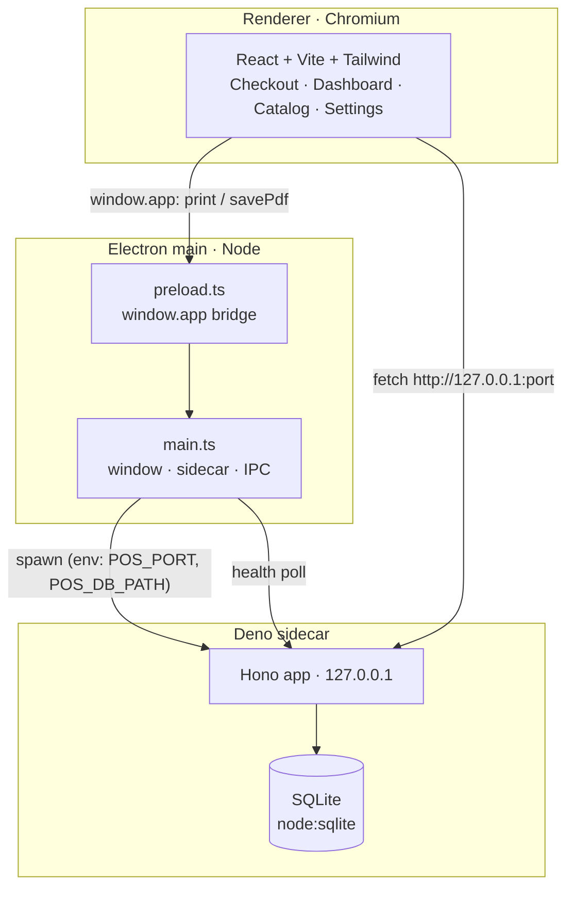

# Architecture

A Local-First App Kit instance is **one desktop app, three cooperating processes, one SQLite
file.** It runs fully offline on a single PC. No cloud, no accounts, no network exposure.

## The three processes

| Process | Runtime | Owns |
|---------|---------|------|
| **electron-main** | Node | The window, picking a free loopback port, spawning + health-polling + killing the Deno sidecar, and OS-only IPC (print, save-PDF). |
| **backend** | Deno + Hono | The HTTP API (loopback only), SQLite persistence, and **all** money math and aggregation. |
| **renderer** | Chromium | Touch-friendly UI. Talks to the backend over `fetch`; calls `window.app` for print/PDF. |

## Trust boundaries

1. **renderer → backend** — plain HTTP over `127.0.0.1`. Runtime-agnostic and cloud-portable
   later, but today never bound to a public interface ([[localhost-only]]).
2. **renderer → electron-main** — a *tiny* `contextBridge` surface (`window.app`) for OS actions
   only, with `contextIsolation:true` and `nodeIntegration:false` ([[secure-electron]]).

The renderer is treated as untrusted: it never sees Node, never computes authoritative totals
([[server-side-totals]]), and gets only the three functions on `window.app`.

## How a sale flows

1. Staff tap catalog buttons in **Checkout**; the cart lives in renderer state.
2. On Cash/Card, the renderer POSTs `lines + payment_type` to `/sales`.
3. The backend **recomputes** subtotal/tax/total from the lines and the stored `tax_rate`,
   taxing only `taxable` lines ([[oklahoma-per-item-tax]]), stamps a local `sale_date`
   ([[local-day-grouping]]), and inserts the sale + line snapshots in one transaction.
4. The renderer opens the receipt in a sandboxed `<iframe srcDoc>` preview; Print/Save-PDF go
   through `window.app` → IPC → a hidden BrowserWindow ([[print-color-fidelity]]).

## Packaging

`deno compile` bakes the backend into a single self-contained exe (no Deno/Node on the target,
[[deno-compile-no-npm]]); `electron-builder` bundles it as an `extraResource` and emits a Windows
NSIS installer. The packaged sidecar runs with no console window ([[windows-sidecar-no-console]]).
