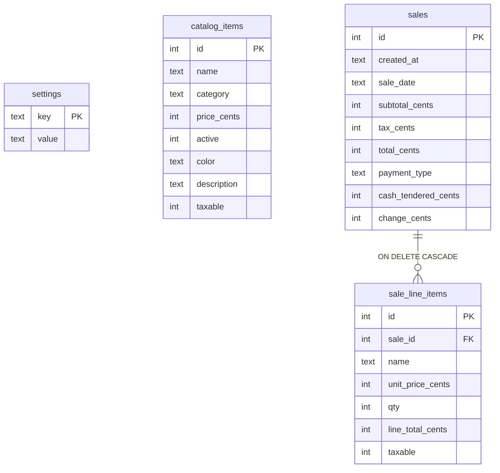

# Data Model

One SQLite file, four tables, never more than it needs. Implemented in `backend/db.ts`.



## Why money is integer cents
Every money column is whole cents (`*_cents`), never a float. Floating-point dollars accumulate
rounding error across line items and tax. All arithmetic happens in `computeTotals()` server-side
([[money-integer-cents]], [[server-side-totals]]).

## Why line items are snapshots
`sale_line_items` copies `name`, `unit_price_cents`, `qty`, and `taxable` at sale time. Editing or
deleting a `catalog_items` row later never rewrites history — last year's receipts stay exactly as
rung. The FK is `ON DELETE CASCADE` so deleting a sale removes its lines.

## Per-item taxability (Oklahoma)
`taxable` (0/1) lives on **both** `catalog_items` (the current setting) and `sale_line_items` (the
snapshot). Tax is the rounded product of the **taxable** subtotal and the single `tax_rate`:

```
tax_cents = round( Σ(unit_price_cents × qty  for taxable lines) × tax_rate )
total     = subtotal_cents + tax_cents
```

A mixed cart — a tax-exempt haircut plus a taxable bottle of pomade — is taxed only on the pomade.
See [[oklahoma-per-item-tax]] and [OKC-COMPLIANCE](../domains/OKC-COMPLIANCE.md).

## Local-day grouping
`created_at` is UTC ISO (for display); `sale_date` is the **local** `YYYY-MM-DD` and is what every
report groups by. Grouping on the UTC slice of `created_at` would drop evening sales from "today"
in Oklahoma's negative UTC offset ([[local-day-grouping]]).

## Migrations
Schema changes are additive and idempotent: `CREATE TABLE IF NOT EXISTS` plus
`addColumnIfMissing(table, col, type)` which checks `PRAGMA table_info` before `ALTER`. New columns
backfill (e.g. `taxable` defaults to 1). Installed copies hold a business's live data, so we never
drop or rewrite ([[additive-migrations]]).
