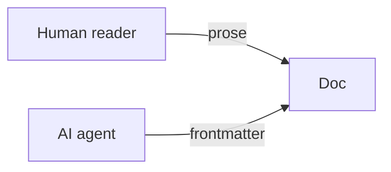

# Documentation Style Guide

Write so a tired operator and a cold-started agent both get what they need on the first read.

## Voice
- **Precise over breezy, but never lifeless.** Lead with the claim, then justify it.
- **Second person for instructions** ("Run `deno task test`"), third person for explanations.
- **No fluff words.** Delete "simply", "just", "obviously", "as you can see".
- **Name the why.** A rule without its reason gets ignored the first time it's inconvenient.

## Structure
- One `# H1` per file, matching the frontmatter `title`.
- Short sections, each answering one question. Tables beat paragraphs for reference material.
- Put the actionable thing **above** the explanation when an operator is the reader.

## Diagrams are text
Use Mermaid or ASCII, never binary images. Text diagrams diff cleanly, render in-terminal, and
stay offline — the same instinct that keeps charts as inline SVG in the app (see [[offline-charts]]).

## Cross-references
- Link siblings with relative paths; link constraints/ADRs with the `[[constraint-id]]` shorthand.
- When you state a fact owned elsewhere, link its `source_of_truth` instead of restating it.

## Money, time, and domain words
- Money is **integer cents** in prose and code alike — write "12000 cents ($120.00)", never "$120.0".
- Dates that matter are **local** days; say so explicitly (see [[local-day-grouping]]).
- Use the canonical core term, then gloss the domain word: "a sale (a barber would say *ticket*)".
  The full map lives in [`docs/spec/GLOSSARY.md`](../spec/GLOSSARY.md).
